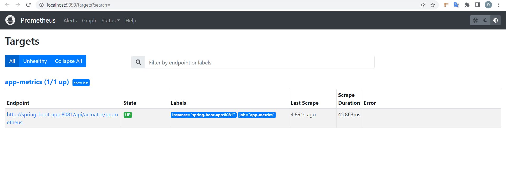
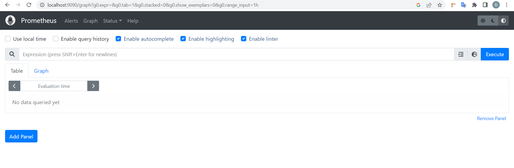
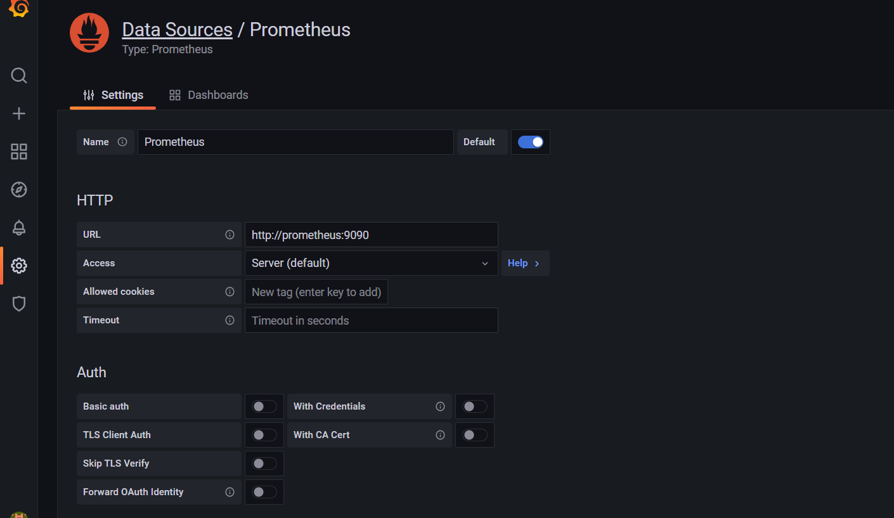
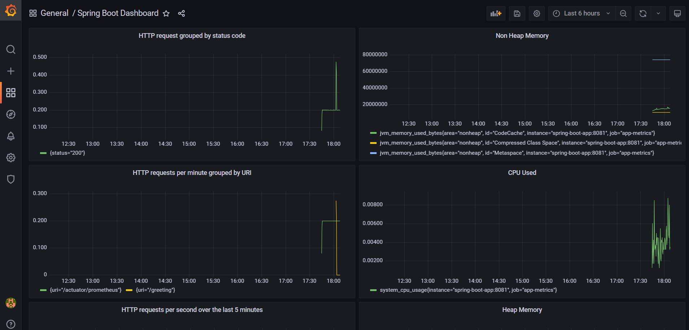

# Monitoring Spring Boot App With Prometheus And Grafana

Check if prometheus connected with spring boot app.  
Access http://localhost:9090/targets. If state is up, prometheus connected with spring boot app.

Access http://localhost:9090/graph for Prometheus's web UI

| Metrics                                                                                  | Query                                                            |
|------------------------------------------------------------------------------------------|------------------------------------------------------------------|
| heap memory used                                                                         | jvm_memory_used_bytes{area="heap"}                               |
| non heap memory used                                                                     | jvm_memory_used_bytes{area="nonheap"}                            |
| % CPU used                                                                               | system_cpu_usage                                                 |
| Get the number of HTTP request grouped by status code                                    | sum(rate(http_server_requests_seconds_count[1m])) by (status)    |
| Get the HTTP requests per second over the last 5 minutes:                                | rate(http_server_requests_seconds_count[5m])                     |
| Get the number of HTTP requests per minute grouped by URI:                               | sum(rate(http_server_requests_seconds_count[1m])) by (uri)       |
| Get the number of HTTP requests that returned a 5xx status code over the last 5 minutes: | sum(rate(http_server_requests_seconds_count{status=~"5.."}[5m])) |

Access http://localhost:3000/ for Grafana UI. Default account is admin/admin. 
### Prometheus
Create datasource -> Prometheus
  
Save and Test
